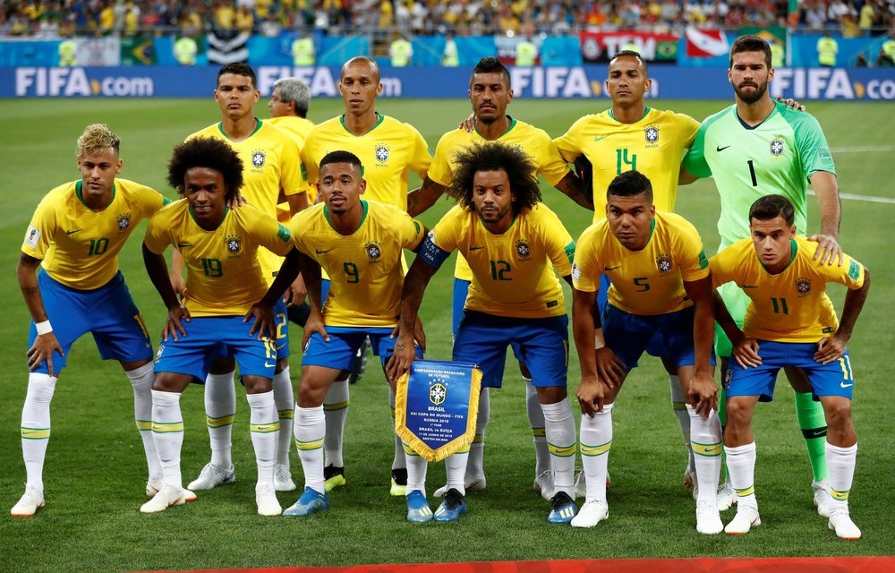

# Relatório Final

# Integrantes:
Guilherme Hideo Tubone - 9019403  
Lucas de Oliveira Pacheco - 9293182 

# FaceFilters:
- Detecção de faces: Encontrar com OpenCV todas as faces humanas
na foto, extraindo os retângulos que as delimitam.  
- Detecção de pontos de referência: A partir da parte da imagem
referente ao rosto, detectar olhos, boca, nariz, etc. Utilizando a biblioteca Dlib.  
- Sobreposição do filtro: Dado um filtro e os pontos de referência no
rosto, sobrepor o filtro nas pontos adequados.  

# Descrição
Em algumas redes sociais como Instagram/Snapchat existe um recurso chamado Stories, em que o usuário pode compartilhar fotos ou vídeos curtos durante 24h. Um dos recursos que existem neste tipo de aplicativo são os filtros animados, que localizam as faces das pessoas na foto e aplica efeitos visuais sobre ela. Objetivo do projeto: Fazer uma réplica deste recurso utilizando Python. O programa irá receber fotos com pessoas e então aplicar filtros sobre o rosto das pessoas. Além disso pode-se capturar a webcam e aplicar o filtro no frame atual.

Imagens utilizadas em /images

  
  
  

- Solução: O problema foi resolvido utilizando Local Binary Patterns Classifier do OpenCV, para encontrar faces na imagem e o "pre-trained 68 facial landmark model" da biblioteca Dlib, para encontrar os "landmarks" das faces (olhos, nariz e boca).
Primeiramente, converteu-se a imagem para escala de cinza; logo após, foi executado o algoritmo para encontrar faces. E, dados os retângulos que contêm as faces, foi executado, para todas as faces, o algoritmo que encontra os "landmarks".
- Em seguida utilizaram-se o retangulo da face retornado pelo LBP do OpenCV e os landmarks retornados pelo Dlib para calcular o tamanho da imagem, o angulo de rotação da face e o ponto na imagem onde o filtro será colocado. Para isso fez-se a Class geometry (em utils/geometry.py) para lidar com a geometria de maneira mais pratica, a parte do código que trabalha com os filtros está em FaceFilters.py, sendo que tanto o codigo para aplicar filtros em foto estática(FaceFilters_image.py) ou para aplicar filtro continuamente no input da webcam(FaceFIlters_webcam.py) importam FaceFilters para aplicar os filtros.

  

- Resultados: apesar de algumas falhas no reconhecimento da face tanto pelo OpenCV ou pelo Dlib, dados os landmarks corretos os filtros são colocados de maneira precisa sobre as faces, detectando angulo de inclinação, o ponto centra em que o filtro deve ser colocado, se a boca está fechada ou aberta.

  
