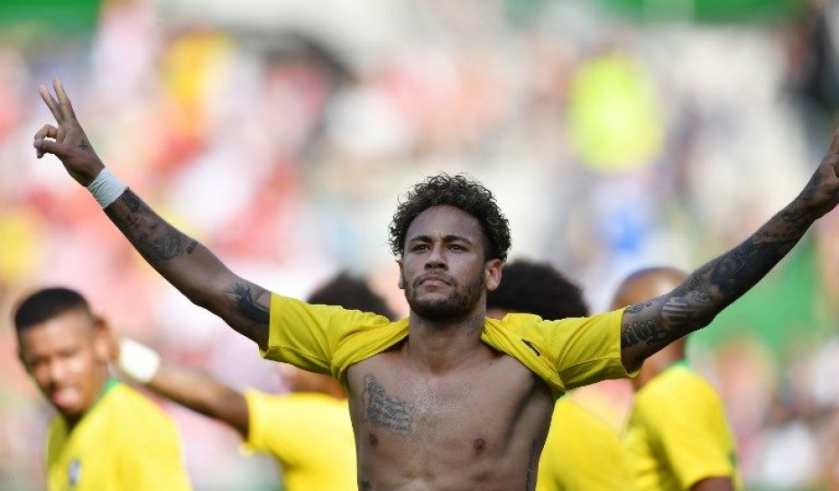
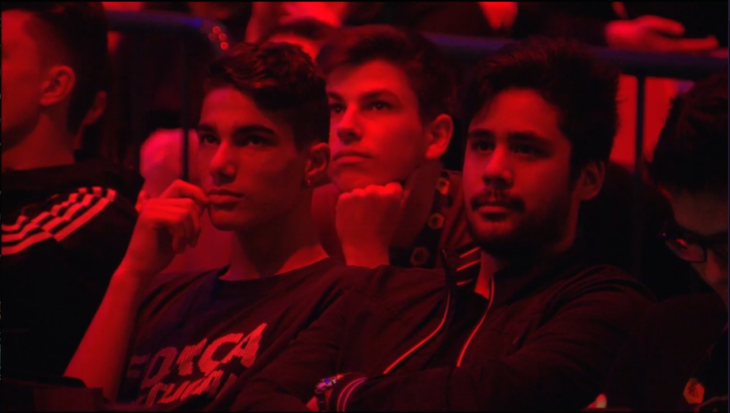
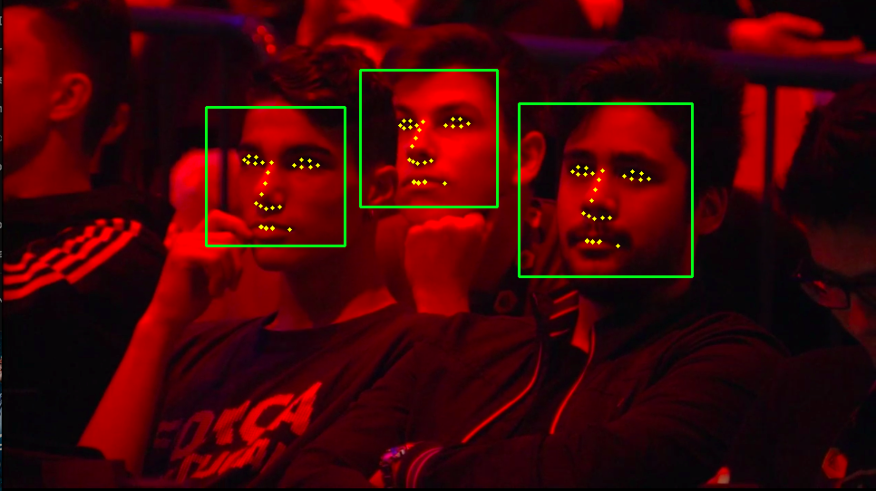

# Relatório Parcial

# Métodos testados
Os primeiros métodos testados foram Local Binary Patterns Classifier do OpenCV, para encontrar faces na imagem e o "pre-trained 68 facial landmark model" da biblioteca Dlib, para encontrar os "landmarks" das faces (olhos, nariz e boca).  
Primeiramente, converteu-se a imagem para escala de cinza; logo após, foi executado o algoritmo para encontrar faces. E, dados os retângulos que contêm as faces, foi executado, para todas as faces, o algoritmo que encontra os "landmarks".  

# Primeiros resultados
Seguem algumas imagens e seus resultados após a aplicação dos primeiros métodos:  

  

  

  

# Próximos métodos
A próxima etapa deste projeto é sobrepor os filtros na faces das pessoas nos lugares apropriados e com o tamanho correto. Para tal, terão que ser feitos dois tipos de operações nos filtros: escala e rotação.  
Dado que temos um retângulo que contém uma face, é necessário calcular o seu tamanho e adequar o tamanho do filtro para tal. Logo após, é necessário encontrar os "landmarks" do rosto e sobrepor os filtros nos lugares certo; Como o rosto pode estar levemente rotacionado, será necessário calcular tal rotação a fim também de adequar o posicionamento do filtro.

